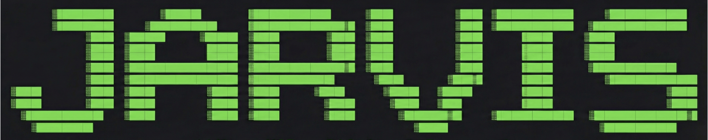
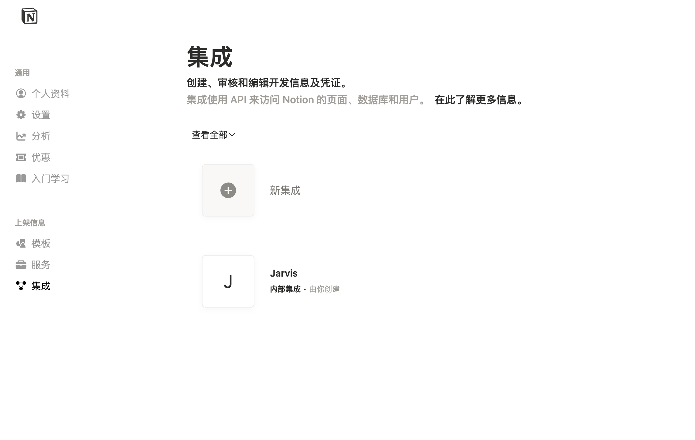
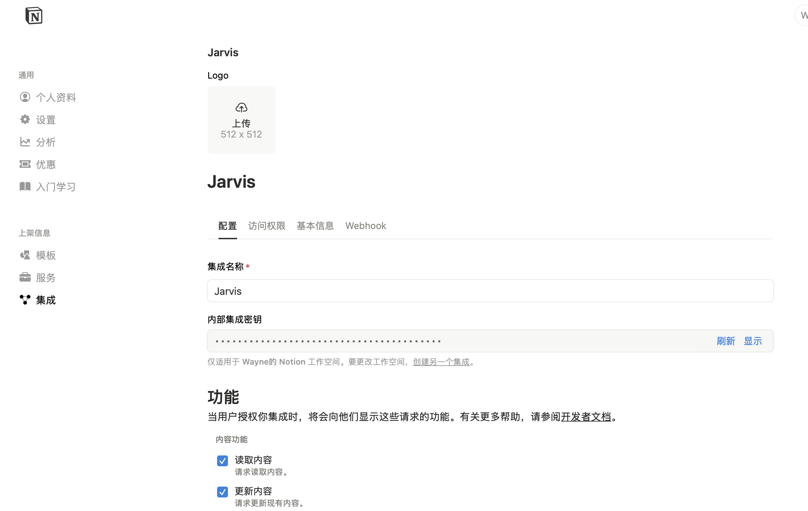
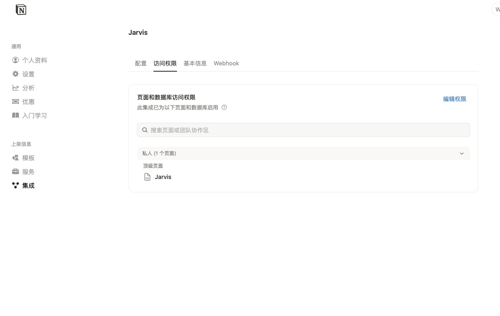

# Jarvis (Just IronMan's Assistant as you know)

**A lightweight, transparent, and developer-first AI Agent framework.**

> "Stop fighting the framework. Start building the agent."



## 💡 Motivation

This project was born out of frustration with heavy, black-box frameworks like LangChain. We've all been there: a library update breaks your RAG pipeline, or you spend hours debugging a stack trace buried 10 layers deep in abstract classes.

**Jarvis is different.** It is "hand-crafted" from first principles to be:
*   **Transparent**: No hidden magic. You can see the `while` loop that runs your agent.
*   **Stable**: No breaking changes every week. You own the logic.
*   **Standardized**: Built on the **Model Context Protocol (MCP)**, not proprietary tool wrappers.

## ⚡ Core Architecture

Jarvis treats the **Agent** as the absolute core. It is a custom-built reasoning engine that we "arm" with modular capabilities:

1.  **The Brain (Agent)**: A pure Python implementation of the ReAct/Loop pattern. It handles reasoning, planning, and execution without heavy abstractions.
2.  **The Hands (MCP_CORE)**: Instead of hard-coding tools, Jarvis implements a native **MCP Client**. It connects to any standard MCP Server (Filesystem, Git, Fetch) or your own custom Python scripts.
3.  **The Memory (RAG)**: A controllable, lightweight RAG pipeline.
    *   **Multi-Format**: Native support for `.pdf`, `.csv`, and `.md`.
    *   **Smart Chunking**: Choose between "Whole Document" or "Recursive Character" splitting strategies.
    *   **Query Rewriting**: Automatically decomposes complex user tasks into targeted search queries to solve the "Lost in the Middle" problem.

## 📂 Project Structure

```text
.
├── agent/              # Core Agent Logic & LLM Client
├── config/             # Configuration files (user_config.json)
├── knowledge/          # Your documents (PDF, MD, CSV)
├── mcp_core/           # Native Model Context Protocol Client
├── output/             # Agent artifacts
├── prompts/            # Centralized System Prompts
├── rag/                # RAG Pipeline
│   ├── chunk/          # Splitting strategies (Recursive, etc.)
│   ├── context.py      # Retrieval logic
│   ├── query_rewriter.py # LLM-based Query Decomposition
│   └── ...
├── utils/              # Shared utilities
└── main.py             # Entry point
```

## 📦 Quick Start

1.  **Clone & Install**
    ```bash
    git clone https://github.com/Jiawe1Zhang/Jarvis.git
    pip install -r requirements.txt
    ```

2.  **Configure Environment**
    Create a `.env` file:
    ```env
    OPENAI_API_KEY=sk-...
    OPENAI_BASE_URL=https://api.openai.com/v1
    # Or for Ollama
    # OLLAMA_BASE_URL=http://localhost:11434/v1
    ```

3.  **Customize Behavior**
    Edit `config/user_config.json` to control RAG strategies:
    ```json
    "embedding": {
      "model": "bge-m3",
      "chunking_strategy": "recursive",  // "whole" or "recursive"
      "enable_query_rewrite": true,      // Enable LLM-based query decomposition
      "rewrite_num_queries": 3           // Number of sub-queries to generate
    }
    ```

4.  **Run**
    ```bash
    python main.py
    ```

## 🧩 Notion MCP (optional)

Connect Jarvis to Notion via MCP without touching agent logic:

1) Create an integration  
   Go to Notion → Integrations → New integration in your workspace. Enable **Read content**, **Update content**, **Insert content**.  
     
   

2) Get the token  
   Copy the Internal Integration Token (`ntn_...`). Keep it in `.env`, not in code.

3) Choose pages/databases  
   Search the pages/databases you want the agent to connect. And give them Permissions.
   

4) Wire it into Jarvis  
   Add to `.env`:
   ```env
   NOTION_TOKEN=ntn_xxx
   ```  
   Add to `config/user_config.json` (`env` placeholders resolve from `.env` at runtime):
   ```json
   {
     "name": "notion",
     "command": "npx",
     "args": ["-y", "@modelcontextprotocol/server-notion"],
     "env": {
       "NOTION_TOKEN": "${NOTION_TOKEN}"
     }
   }
   ```
   Run `python main.py`. Startup logs should show Notion tools; 401/403 usually means bad token or the page was not shared with the integration.

## ✅ Features Checklist

- ✅ **MCP Integration**: Native support for Model Context Protocol tools.
- ✅ **Multi-Format RAG**: Support for `.pdf`, `.csv`, and `.md` files.
- ✅ **Advanced RAG Strategies**:
    - ✅ Recursive Character Text Splitting.
    - ✅ Query Rewriting (LLM-based).
    - [ ] **Reranking**: Cross-encoder based result re-ordering.
    - [ ] **Advanced Chunking**: Semantic and Agentic splitting strategies.
    - [ ] **Hybrid Search**: Vector + Keyword (BM25) retrieval.
- [ ] **Advanced Vector Stores**: Support for Milvus/Chroma (Currently In-Memory).
- [ ] **ReAct Optimization**: Enhanced fallback strategies for local SLMs.
- [ ] **Local Fine-tuning Pipeline (Model Ops)**:
    - [ ] **Hugging Face Integration**: Script to download base models (e.g., Llama-3, Qwen) directly from HF/ModelScope.
    - [ ] **LLaMA-Factory Bridge**: Automated config generation to trigger LoRA/Full fine-tuning jobs using your RAG data.
    - [ ] **GGUF Conversion**: Integrated `llama.cpp` conversion scripts to transform fine-tuned HF weights to `.gguf`.
    - [ ] **Ollama Import**: Auto-generate `Modelfile` and run `ollama create` to serve your custom model immediately.

## 📄 License

MIT License
